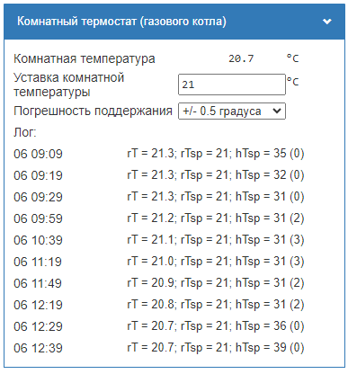

# WB-Room-thermostat
В ожидании, когда исправят прошивку WBE2-I-EBUS и шлюз наконец начнет корректно работать в режиме "по комнатной температуре".

Подготовил скрипт с незатейлевым алгоритмом расчета уставки температуры теплоносителя.

Для использования скрипта с подключенным по умолчанию шлюзом (т.е. просто воткнут в слот расширения и выполнены настроки устройства в этом слоте) достаточно указать адрес контрола датчика темапературы. В моем случае это "wb-w1/28-00000dde6e29".

Расчет уставки отопления производится роаз в 10 минут (в моем случае, сомневаюсь что нужно чаще). Возможно расчет с периодом в 15 минут организует более тонкий подбор температуры уставки отопления.
Окончательные значения парметров зависят от используемого оборудования, характерисчстик системы отопления.

```js

// Контрол с которого снимается комнатная температура
var controlTermometr = 'wb-w1/28-00000dde6e29';
// Контрол, которому присваивается уставка отопления
var controlHeatingSetpoint = 'wbe2-i-ebus_12/Heating Setpoint';
// Контрол с коротого считывается состояние контуров котла
var controlBoilerStatus = 'wbe2-i-ebus_12/Boiler Status';
...

```

При сохранении создается устройство, позаоляющее выбирать уставку комнатной температуры и диапазон ее поддержки.


